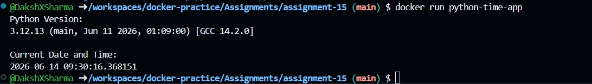

This assignment contains a simple Dockerized Python application.

The application prints:
- Current Python version
- Current date and time

## Build Docker Image:
docker build -t python-time-app .
## Run Docker Container:
docker run python-time-app

## Sample Output Screenshot:
